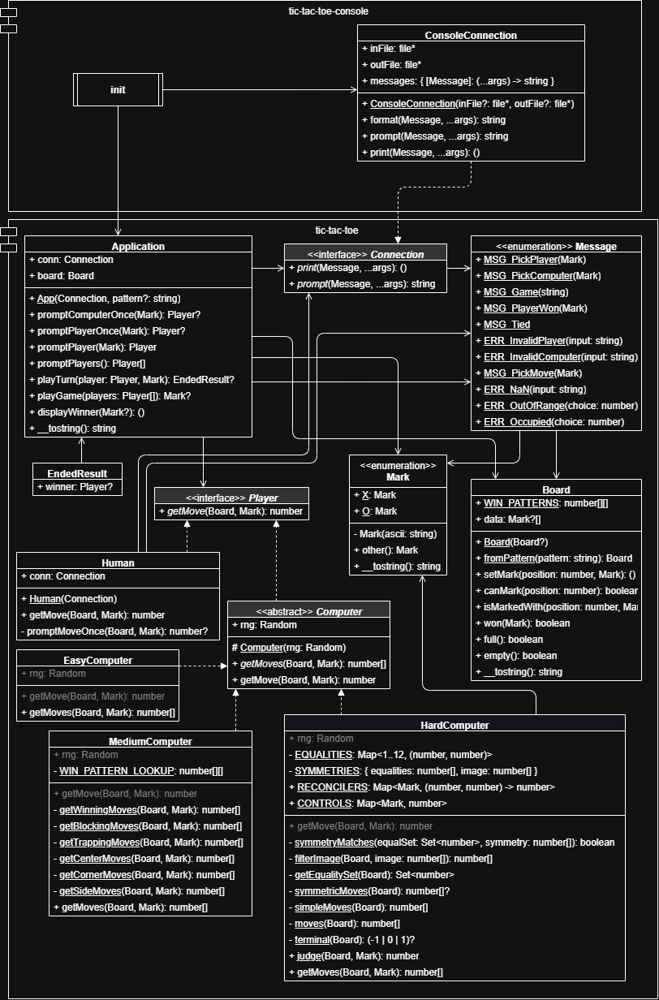

# tic-tac-toe.spec

This is a specification of a game of tic-tac-toe. It is meant to test the various parts of a programming language and their ecosystem:

- array manipulation (`Board.data`)
- the call stack (`App.{playGame, choosePlayers}`)
- nullability/nilability (`App.playGame`, `MediumComputer.getMoves`)
- error handling (`App.choosePlayer`, `Human.getMove`)
- algebraic data types (`Message`)
- OOP stuff
  - how to write an interface (`Player`, `Connection`)
  - how to write an abstract class (`Computer`)
  - accessibility of fields and methods
- random number generation (`Computer`)
- unit tests (e.g. `Mark` and `Board` tests)
- integration tests (`Application` tests)
- parametric tests (`CommonTactics` tests)
- mocking (`Application` and `Human` tests)
- documentation, both editor and publishing support

These are the programming languages and tools the tic-tac-toe specification has been implemented in. The below table is sorted by approximately when they were started.

| Language   | Core                                                      | Console                                                   | UI  | Multiplayer | Blockers                 |
| ---------- | --------------------------------------------------------- | --------------------------------------------------------- | --- | ----------- | ------------------------ |
| Java       | [Done](https://github.com/goldenstein64/tic-tac-toe.java) | [Done](https://github.com/goldenstein64/tic-tac-toe.java) |     |             |                          |
| Lua        | [Done](https://github.com/goldenstein64/tic-tac-toe.lua)  | [Done](https://github.com/goldenstein64/tic-tac-toe.lua)  |     |             |                          |
| Python     | [Done](https://github.com/goldenstein64/tic-tac-toe.py)   | [Done](https://github.com/goldenstein64/tic-tac-toe.py)   |     |             |                          |
| MoonScript | [Done](https://github.com/goldenstein64/tic-tac-toe.moon) | [Done](https://github.com/goldenstein64/tic-tac-toe.moon) |     |             |                          |
| Haskell    | WIP                                                       | WIP                                                       |     |             | Tests + old Computer     |
| Haxe       | [Done](https://github.com/goldenstein64/tic-tac-toe.hx)   | [Done](https://github.com/goldenstein64/tic-tac-toe.hx)   |     |             |                          |
| C#         | [Done](https://github.com/goldenstein64/tic-tac-toe.cs)   | [Done](https://github.com/goldenstein64/tic-tac-toe.cs)   |     |             |                          |
| F#         | [Done](https://github.com/goldenstein64/tic-tac-toe.fs)   | [Done](https://github.com/goldenstein64/tic-tac-toe.fs)   |     |             |                          |
| GNU C      | [Done](https://github.com/goldenstein64/tic-tac-toe.c)    | [Done](https://github.com/goldenstein64/tic-tac-toe.c)    |     |             |                          |
| VFXForth   | WIP                                                       | WIP                                                       |     |             | Adapting GForth          |
| Ruby       | WIP                                                       | WIP                                                       |     |             | Sorbet/Minitest incompat |
| Rust       | [Done](https://github.com/goldenstein64/tic-tac-toe.rs)   | [Done](https://github.com/goldenstein64/tic-tac-toe.rs)   |     |             |                          |
| TypeScript | [Done](https://github.com/goldenstein64/tic-tac-toe.ts)   | [Done](https://github.com/goldenstein64/tic-tac-toe.ts)   |     | Done-ish    |                          |
| PowerShell | WIP                                                       | WIP                                                       |     |             |                          |
| PHP        | [Done](https://github.com/goldenstein64/tic-tac-toe.php)  | [Done](https://github.com/goldenstein64/tic-tac-toe.php)  |     |             |                          |

## Not Started

- Bash
- C++
- COBOL
- Dart
- Flutter
- Fortran
- Go
- JavaScript
- Kotlin
- Lisp (e.g. Clojure/Scheme/Racket)
- OCaml
- Pascal
- Perl
- PHP
- R
- Scala
- Scratch
- Swift
- Tcl
- Visual Basic
- YueScript

## Why?

This is mainly supposed to be a learning resource for how to write useful programming patterns in many languages, like the above topics. If there is a programming topic you'd like to see and a place you think it could go, I'll be happy to hear about it!

## File Structure

There is a general file structure for the game's source code. Here is a tree without any of the file extensions.

```plain
.
├── Application
├── player/
│   ├── Player
│   ├── Human
│   ├── Computer
│   ├── EasyComputer
│   ├── MediumComputer
│   └── HardComputer
└── data/
    ├── Board
    ├── Mark
    ├── Message
    └── Connection
```

There is also a file structure for the tests.

```plain
.
├── Application
├── player/
│   ├── Human
│   ├── CommonTactics
│   └── HardComputer
├── data/
│   ├── Board
│   └── Mark
└── test/
    └── MockConnection
```

If there is a language or runtime constraint that doesn't allow this file structure, exceptions can be made. The game source and tests can be in the same folder or separate ones, as long as it is easy to tell what is a test and what is source code.

Here is a UML diagram created from my Lua implementation of the codebase.



## Gameplay

A program running the tic-tac-toe game should have a workflow like below:

1. The user chooses _Player X_ and _Player O_'s player type, either a _Human_ or a _Computer_.
   - If the user chooses _Computer_, they also choose its difficulty.
2. An empty _Board_ is shown and _Player X_ goes first.

   - In console applications, boards can be printed out, and they usually look like this:

   ```plain
    X |   |
   ---|---|---
      | O |
   ---|---|---
      |   | X
   ```

3. Turn alternates between _Player X_ and _Player O_ until an ending condition is reached.
4. A winner is announced. If there is no winner, a tie is announced instead.

### Difficulties

- Easy computers simply choose a random unoccupied position on the board.
- Medium computers are programmed to iterate through an ordered list of "move getters." One position is chosen at random from the first non-empty set returned by a "move getter." There are six "move getters," listed in descending priority:
  1. positions that guarantee a win in 1 turn
  2. positions that stop the other player from winning next turn
  3. positions that guarantee a win in 2 turns
  4. the center of the board
  5. the corners of the board
  6. the sides of the board
- Hard computers are programmed to use the Minimax algorithm. Every possible outcome a tic-tac-toe board can have is judged and explored recursively, and the best set of choices is computed from this judgment. One position is then chosen from this set at random.
  - This tends to be an expensive operation, so it can be partially or completely implemented in a pre-computed fashion instead.

## I/O

The inputs and outputs of the program are sent through an interface called a _Connection_ so that _Message_ objects can be tracked clearly. This is very useful for unit testing purposes; it can be mocked so that inputs can be set by tests and outputs can be compared.

The _Message_ file enumerates all the possible messages the program may send, including info messages, prompts, and errors. The actual structure of messages depends on the language, but they should be equivalent to an enumeration where some message types take arguments, i.e. the typical usage of an algebraic datatype.

The program is prepared to handle invalid input from a prompt; it will send an error-labeled message to output if it occurs and ask for another input. This is specified in the tests.

In theory, this also allows completely abstracting away how the program is interacted with. Even though a console application is the easiest to implement, messages could possibly be interpreted in other ways to create desktop applications and servers.

## Example Implementations

- a console application, the most common and simplest
- a desktop application with UI components
- a static website
- any of these implementations built with multiplayer in mind
